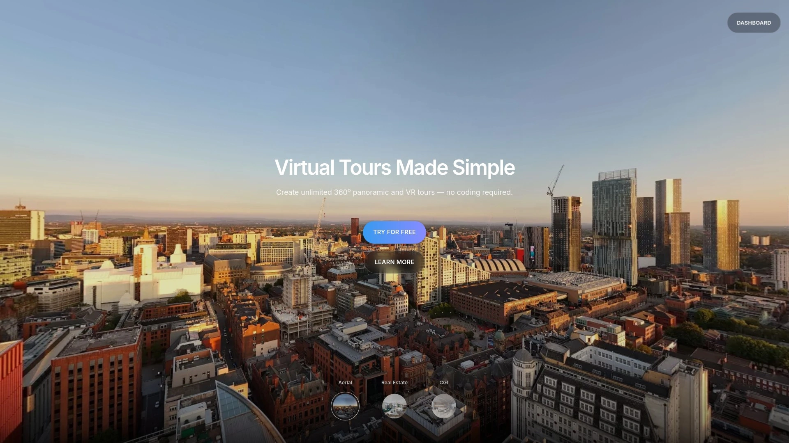
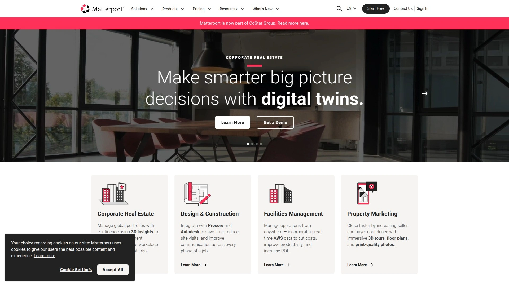
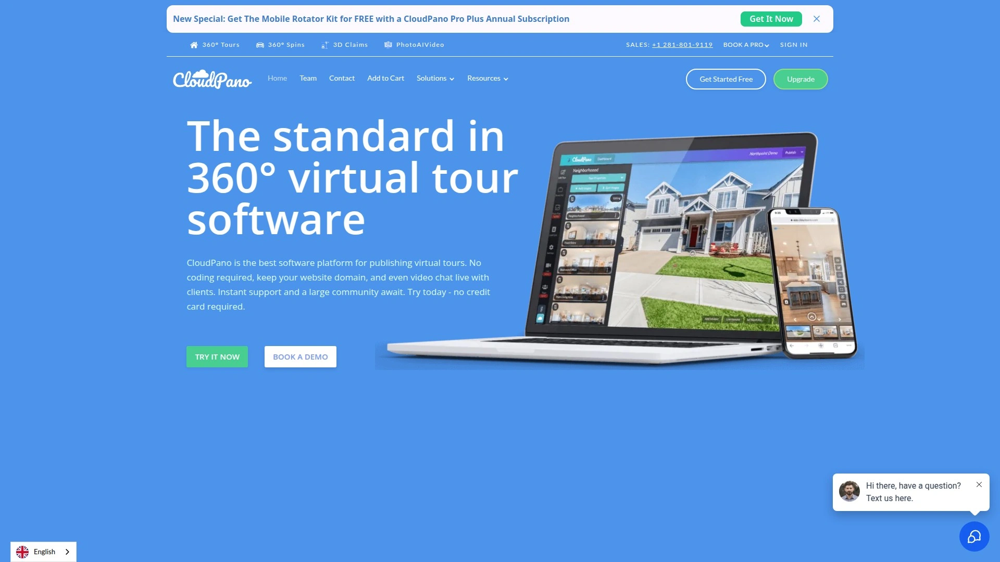
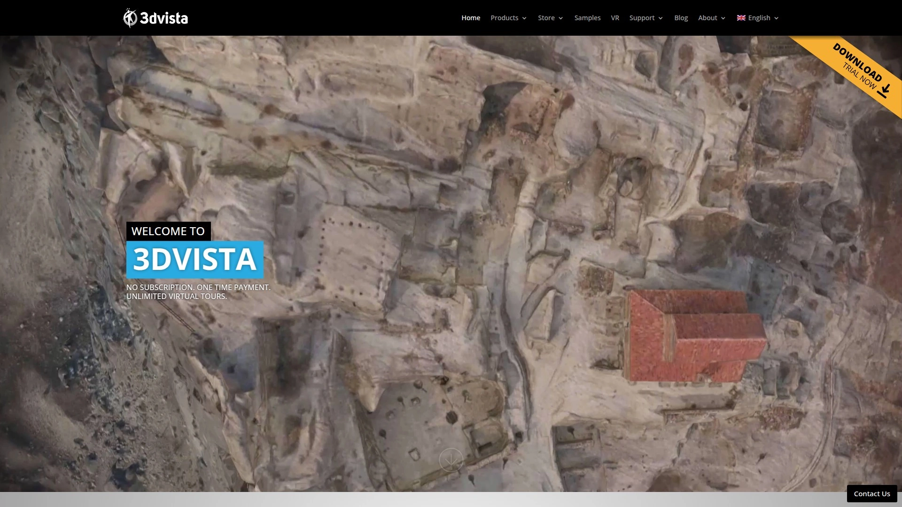
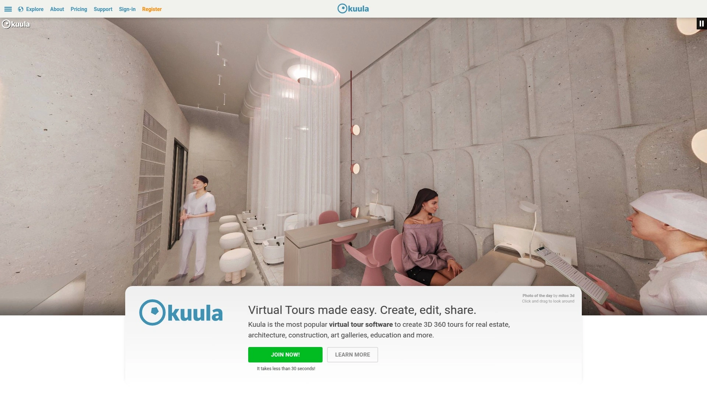
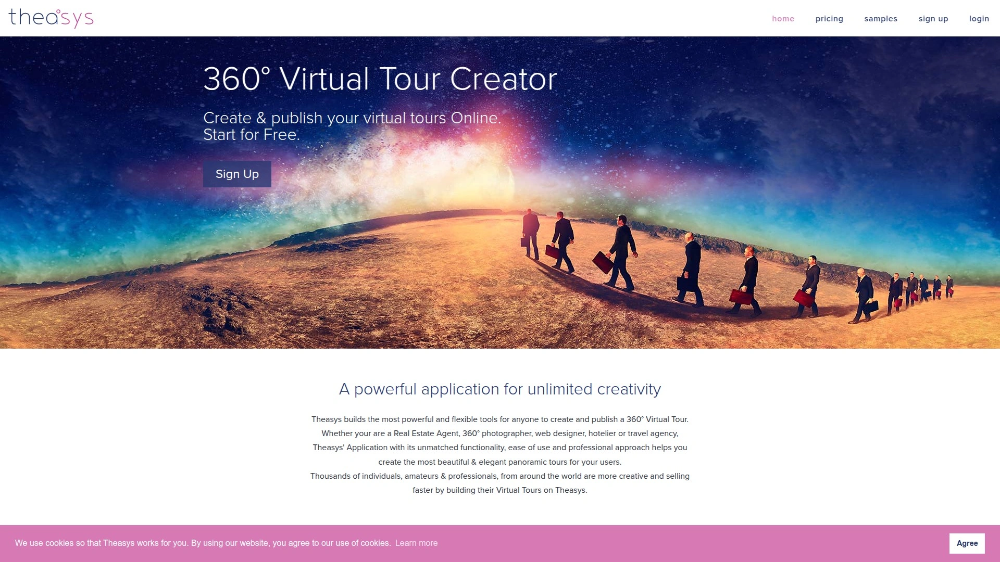
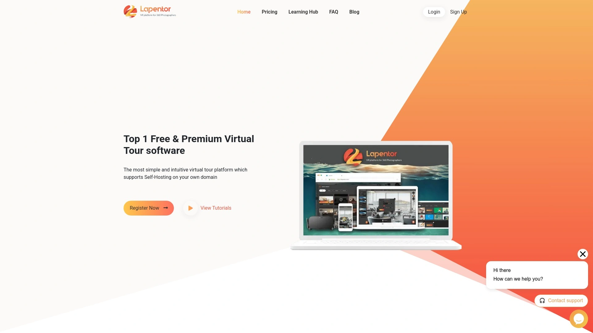
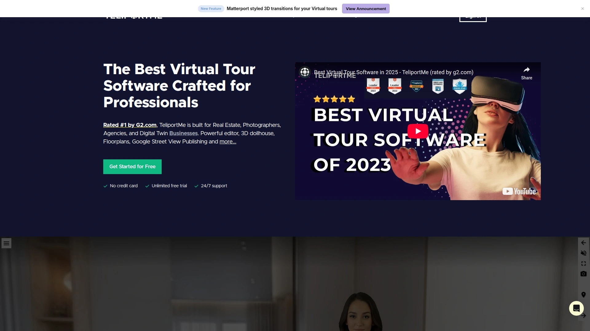
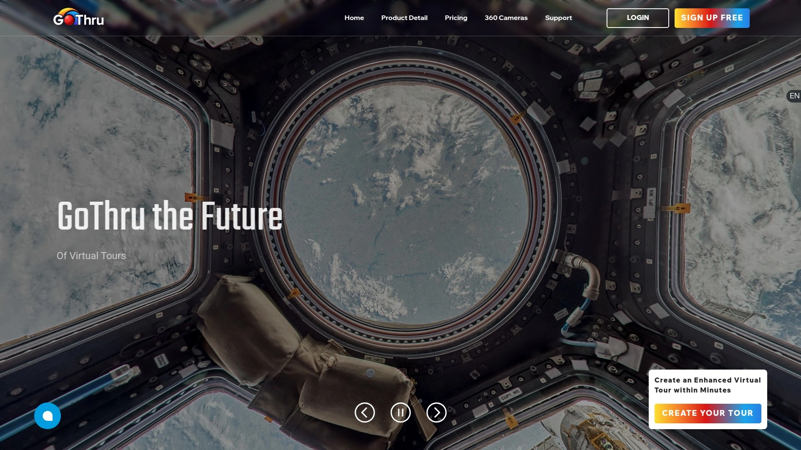
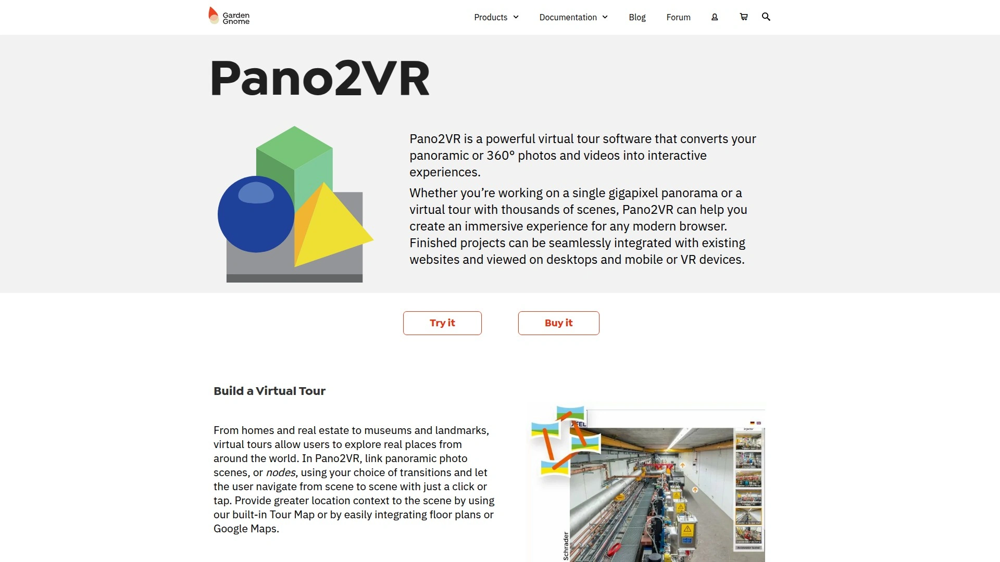

# 2025年十大最佳360虚拟游览创建工具

房地产拍摄完360全景照片后不知道如何整合成可交互的游览、传统网页展示缺乏沉浸感导致客户流失、手动编写代码创建虚拟游览耗时数周——这些问题在360虚拟游览创建工具这里都能解决。从批量上传全景图片到添加热点链接再到嵌入视频音频,这些平台能让你在几分钟内创建专业级虚拟游览,无需任何编程知识。市面上的工具从完全免费到每月数百美元的企业版都有,支持的功能从基础的场景链接到高级的3D建模和VR兼容不等。这份榜单筛选出10款在易用性、功能丰富度和输出质量上表现突出的平台,无论你是房地产摄影师、旅游营销团队还是建筑可视化工作室,都能找到适合自己工作流程的方案。

## **[Koala 360](https://koala360.com)**

无代码360游览创建平台,免费用户也无水印,专为替代已停运的Roundme而打造。

Koala 360的诞生源于Roundme突然停止服务导致大量用户丢失游览内容的痛点。开发团队决定构建一个**更可靠、功能更强的下一代虚拟游览创建工具**,并且坚持对所有用户提供干净美观的体验——即使是免费套餐也完全不添加水印或品牌标识。这种理念在行业内相当罕见,大多数竞品会在免费游览上强制显示logo。

核心工作流程简化到极致。批量上传2:1比例的全景图片(每张最高50MB),然后用拖放方式将一张图片的缩略图拖到另一张上,系统会自动创建热点图标实现场景跳转。媒体信息点功能让你能添加文字、音频、视频和2D图片来扩展游览内容。**A/B对比功能**是Koala独有的创新——可以在同一位置展示前后对比或日夜场景,这对建筑设计和3D工作室特别有价值。

自定义选项丰富,包括自动旋转、全屏模式、隐藏缩略图等多种查看体验设置。发布后可以通过链接分享或用iFrame代码嵌入网站。平台还与3D可视化服务商和网页开发者网络合作,提供定制化的游览创建和网站嵌入支持。

Pro会员享受自动图片压缩优化,确保游览加载速度快的同时保持高质量。免费用户需要手动使用TinyPNG等工具进行无损压缩。WordPress插件让在网站上添加虚拟游览变得极其简单。适合房地产代理、摄影师、旅游公司、CGI工作室和任何需要清晰无干扰游览展示的专业人士。

## **[Matterport](https://matterport.com)**

3D数字孪生技术领导者,提供从捕获到分享的完整沉浸式体验,行业标准级企业方案。

Matterport不仅仅是360游览创建工具,而是**完整的3D空间数字化平台**。使用Matterport专用相机或支持的360相机拍摄后,系统会自动生成高精度3D模型、平面图和传统360游览。这种"数字孪生"技术让用户能在虚拟空间中精确测量距离、查看房间尺寸、理解空间关系,远超传统全景图片的展示能力。

订阅计划从免费到企业级覆盖多个层次。免费版提供1个活跃空间和2个用户,适合测试平台功能。Starter套餐每月9.99美元包含5个活跃空间,支持嵌入分享和Google街景发布。Professional套餐69美元/月提供25个空间、5个用户、团队协作和自动面部模糊功能。Business和Enterprise套餐服务大规模项目,分别支持125-300个空间。

**附加服务扩展功能边界**。MatterPak技术文件包含OBJ、点云、XYZ文件,适合建筑师和工程师进行深度分析。TruePlan服务为保险理赔专业人士提供精确2D平面图,与Xactimate软件原生集成。自动发布到Realtor.com和Google街景增强房源在线曝光度。

价格相对较高但功能最全面,特别适合房地产经纪、建筑事务所、保险公司、酒店集团等对精度和专业性有严格要求的企业客户。如果只需要基础360游览而非3D建模,Matterport可能过于复杂和昂贵。

## **[CloudPano](https://www.cloudpano.com)**

实时视频聊天功能的360游览平台,让代理能远程引导客户浏览物业,加速成交周期。

CloudPano的核心差异化功能是**实时360度视频聊天**。房地产经纪人可以在360游览环境中与潜在客户进行实时对话,即时回答问题、引导注意力到重要细节、建立信任关系。这种guided tour体验有效弥合了静态游览和现场看房之间的差距,特别适合远距离客户或需要预筛选高意向潜在客户的场景。

平台设计注重快速部署和易用性。界面清晰直观,不需要extensive技术背景就能创建和发布游览。基础操作简单,但高级功能如3D玩偶屋创建可能需要一定学习时间。Google街景集成让游览能直接发布到Google地图,显著提升房源在线可见性和SEO效果。

自定义品牌选项允许白标整个体验——移除CloudPano品牌并使用自己的域名。MLS合规游览生成功能简化房地产列表流程。离线模式让你能安全下载游览并在没有网络的情况下向客户展示。移动应用支持iOS和Android,直接从手机构建和编辑游览。

定价采用分级模式,最强大的功能如实时聊天保留给高级付费套餐。适合房地产代理、教育机构、建筑专业人士和任何需要通过互动虚拟游览增强客户参与度的企业。

## **[3DVista](https://www.3dvista.com)**

一次性付费无订阅模式的专业虚拟游览软件,自1999年起服务行业,功能深度和定制自由度极高。

3DVista采用行业罕见的**永久许可证模式**而非订阅制。一次性支付后即可创建无限数量的虚拟游览,没有持续的月度或年度费用。这种定价结构对需要大量制作游览的专业人士来说成本效益显著,特别是长期使用的情况下。

软件功能深度适合从初学者到高级用户的各个层次。兼容所有360度相机和DSLR相机拍摄的全景照片,包括Ricoh Theta系列、Insta360等主流设备。**教育功能扩展**让虚拟游览不仅是展示工具,还能变成互动教学和测试平台——支持寻宝式发现热点、问题卡片、测验、集成评分系统。

托管服务可选。完成游览创建后,可以一键上传到3DVista的个人托管账户,系统会自动生成直接链接和嵌入代码。这对没有自己服务器或不熟悉FTP上传的用户特别方便。但托管服务是可选的——你始终可以将游览上传到自己的服务器或第三方主机。

免费App支持所有设备,提供高质量虚拟游览的实时预览、离线查看和跨桌面、移动、VR设备的无缝集成。最新版本支持3D高斯散射模型,这是创建超逼真3D模型的革命性技术。托管服务起价99欧元/年。适合专业摄影师、房地产可视化工作室、教育机构和需要深度定制功能的高级用户。

## **[Kuula](https://kuula.co)**

云端虚拟游览软件专注易用性和快速发布,GDPR合规,适合房地产、酒店、建筑和教育行业。

Kuula的定位是**"任何业务都能用的第一虚拟游览软件"**。平台遵守GDPR(通用数据保护条例),确保欧洲用户的数据隐私合规。企业可以在界面上添加自定义企业logo,增强品牌价值。

内置编辑器功能全面。支持添加平面图、地图、标签、图片、背景音频和热点来创建360度虚拟游览。客户可以通过手机、Samsung Gear VR、Oculus Go等多种设备查看VR图像和视频。管理者能创建私密游览,只与特定客户或团队成员分享,并根据需求调整视频播放器设置。

批量上传功能让处理大量全景图片变得高效。视频播放器提供多种编辑工具,支持全景视图。摄影师可以通过邮件、短信、Facebook、Twitter、Reddit等社交平台轻松分享360度虚拟内容。

起步价每月20美元,提供扁平费率订阅。用户评价称Kuula在易用性和性价比之间取得良好平衡。Reddit讨论中被推荐为介于基础工具和Matterport之间的中间选项。适合中小型房地产公司、酒店营销团队、建筑可视化工作室和教育机构。

## **[Theasys](https://www.theasys.io)**

强大且灵活的VR编辑器,无限全景和虚拟游览创建,精致热点编辑和对象预设功能专业级。

Theasys为**无限创造力构建最强大灵活的工具**。无论你是房地产代理、360摄影师、网页设计师、酒店经营者还是旅行社,Theasys的无与伦比功能性、易用性和专业方法帮助创建最美丽优雅的全景游览。全球数千名个人、业余爱好者和专业人士通过在Theasys上构建虚拟游览来提高创造力和销售速度。

VR编辑器功能深度令人印象深刻。支持无限全景和虚拟游览、复杂的链接模块、实时全景增强、强大的热点编辑器。热点过渡效果、字体图标、自定义图片、3D文字等多样化元素可用。多边形绘图工具、对象预设和增强配方让创作过程更高效。地图、平面图和方向指示器帮助用户理解空间布局。天顶地底修补功能修复全景照片的常见瑕疵。

嵌入和定制选项极其灵活。无限嵌入数量、自定义品牌、VR就绪、全景缩略图堆栈、自定义外观。响应式设计适配所有设备,陀螺仪支持增强移动体验。虚拟游览分享链接和特定视角分享链接让传播更精准。支持下载并自托管游览,完全控制内容。

高级嵌入选项包括多重嵌入、Google Analytics追踪、密码保护、域名限制、SEO选项和WordPress插件。亚马逊云提供无限安全存储,全球CDN确保最快交付速度,自动更新和先进缓存技术优化性能。适合追求极致定制自由度、需要企业级安全和性能、管理大量游览项目的专业虚拟游览制作公司和大型企业。

## **[Lapentor](https://lapentor.com)**

免费虚拟游览软件支持VR和360全景,专为房地产设计,提供无限项目和托管。

Lapentor的最大吸引力是**完全免费**且功能不打折扣。平台提供无限项目创建、无限托管和完整的VR支持,这在同类工具中相当罕见。对于预算有限的个人摄影师或小型房地产公司来说,Lapentor消除了入门障碍。

功能覆盖虚拟游览创建的所有基本需求。上传360度全景照片、链接场景、添加热点、嵌入多媒体内容、自定义UI。VR兼容性让用户能通过头显设备体验沉浸式游览。房地产优化功能包括楼层平面图集成、联系表单、潜在客户捕获工具。

虽然免费,但Lapentor也提供付费Pro版本以解锁更多高级功能。免费版对大多数基础用途已经足够,Pro版主要服务于需要白标品牌、更高存储限额和优先支持的专业用户。

Reddit讨论中,Lapentor被推荐为"真正免费且功能实用"的选择。用户评价称适合刚起步、预算紧张但需要专业输出的摄影师和代理。适合自由职业摄影师、初创房地产公司、小型旅游企业和任何希望零成本尝试虚拟游览营销的用户。

## **[TeliportMe](https://teliportme.com)**

20000多家企业选择的虚拟游览软件,实时引导游览和潜在客户生成工具整合。

TeliportMe提供**高保真成像与互动功能的融合**。实时引导游览功能让代理能亲自带领潜在租户从任何地方远程游览物业,这对吸引外州或国际客户特别有价值。这种个性化参与体验对奢侈品或高价值租赁物业尤其有效。

平台设计兼顾易用性和可扩展性。物业管理公司能快速创建并在大型物业组合中部署沉浸式游览。自定义品牌、分析和潜在客户生成工具直接集成到游览体验中。这让TeliportMe不仅是展示工具,更是主动的潜在客户捕获和转化系统,帮助缩短市场上的天数。

Google街景集成是显著优势。发布游览到Google地图能大幅提升本地SEO和在线可见性。高分辨率360度照片支持确保视觉吸引力和专业性。定价竞争力强且可扩展,从少量物业到extensive组合都能适应。

学习曲线方面,基础游览创建流程直观,但掌握实时引导游览等高级功能可能需要练习。虽然起步套餐实惠,但访问全部高级功能的大型组合成本会上升。缺少Matterport那样的3D玩偶屋视图。适合物业管理公司、房地产营销团队、需要潜在客户转化工具的企业。

## **[My360](https://my360tours.com)**

扁平费率订阅模式的经济型虚拟游览软件,无限游览创建,实时视频聊天和可定制弹窗。

My360的最大卖点是**可预测的扁平费率定价**。无限游览创建无需按项目或托管付费,这对管理大型物业组合的团队来说预算控制更容易。这种定价透明度消除了"创建越多付费越多"的顾虑。

平台专注易用性。拥有360相机甚至DSLR的用户都能快速上传图片并构建游览。简单的拖放编辑器让没有extensive技术经验的人也能使用。从拍摄到上线分享的周转时间快。

互动功能丰富体验。实时视频聊天让代理能远程引导潜在租户游览物业,实时回答问题并建立信任。可定制弹窗可以添加多媒体内容,增强参与度。自定义品牌选项让游览符合企业形象。

局限性在于缺少高级建模功能。不创建3D玩偶屋视图或尺寸平面图,这些是Matterport等高端平台的标配。报告和分析能力相对基础,不如企业级解决方案详细。没有专有相机,完全依赖第三方硬件进行图像捕获。

价格对比显示My360在成本效益上有明显优势。适合预算有限、需要大量创建游览、重视简单快速部署的中小型房地产公司和物业管理团队。

## **[GoThru](https://gothru.co)**

虚拟游览制作工作流优化平台,从拍摄到交付的完整解决方案,适合专业摄影师和代理。

GoThru定位为**"最佳虚拟游览软件"**,专注于优化专业摄影师和房地产代理的工作流程。平台不仅是编辑器,更是从拍摄计划、现场捕获、后期处理到客户交付的端到端管理系统。

项目管理功能帮助追踪多个拍摄任务。调度工具协调摄影师和客户的时间安排。自动化工作流减少重复性手动任务,让团队能专注创造性工作。客户门户让房地产代理能直接查看、审批和分享游览,无需邮件来回。

编辑功能全面但不过度复杂。支持标准的场景链接、热点、多媒体嵌入、品牌定制。输出质量专业,适合商业使用。集成第三方服务如MLS系统、房地产营销平台,简化发布流程。

定价根据业务规模和功能需求定制。适合虚拟游览摄影工作室、房地产营销代理、管理多个摄影师的公司和需要客户协作功能的企业服务提供商。

## **[Pano2VR](https://ggnome.com/pano2vr)**

高度可定制的全景转VR工具,Skin Editor允许独特界面设计,千兆像素支持和离线VR游览。

Pano2VR以**灵活性和高水平定制**脱颖而出。用户可以将全景照片转换为互动360游览,配备可定制皮肤、动态热点和嵌入多媒体内容。这种自由度让创作者能打造真正独特、符合品牌的游览体验。

核心功能包括通过过渡和内置地图或平面图链接全景场景创建沉浸式游览。Patch Mode以非破坏性方式修正图像缺陷以改善视觉效果。**Skin Editor**是Pano2VR的王牌——允许设计独特界面、自定义按钮和控制器。千兆像素支持允许深度图像缩放以展示惊人细节。

WordPress插件支持导出游览为HTML5便于网站嵌入。VR兼容性包括WebVR可直接从网页创建沉浸式VR体验,以及VRTourviewer应用集成用于离线VR游览。这种离线能力对需要在没有网络连接的展会或现场演示场景特别有价值。

学习曲线相对陡峭,特别是要充分利用高级定制功能需要时间投入。但对于追求完全控制和独特设计的专业人士,这种投入是值得的。适合摄影专业人士、房地产高端市场、旅游推广、博物馆虚拟展览和任何需要精细视觉呈现和品牌定制的应用。

## 常见问题

**免费虚拟游览软件够用吗还是必须付费?**

看你的使用场景和输出要求。Koala 360和Lapentor的免费版本提供核心功能且无水印,对个人摄影师或小型代理完全够用。如果每月只创建2-5个游览,免费方案通常能满足需求。但如果需要白标品牌、优先技术支持、高级分析、更大存储限额或实时视频聊天等功能,付费套餐更合适。Matterport和CloudPano的企业功能如CRM集成、团队协作、API访问通常只在付费版提供。对于测试或入门阶段,建议从免费版开始,确认价值后再升级。

**360游览和3D虚拟游览有什么区别?**

技术实现和沉浸感深度不同。360游览基于全景照片拍摄,用户通过热点在不同场景间跳转,类似站在固定点旋转查看。3D虚拟游览如Matterport创建完整空间的数字孪生模型,用户可以自由"行走"在空间中任意移动视角,还能精确测量距离和查看3D玩偶屋俯视图。360游览制作更快、成本更低、文件更小,适合快速展示和在线分享。3D游览提供更强沉浸感和分析功能,但需要专用设备、处理时间更长、订阅费用更高。房地产营销通常360游览已足够,建筑设计和保险理赔可能需要3D精度。

**需要什么样的相机来创建虚拟游览?**

大多数平台兼容多种相机类型。专业360相机如Ricoh Theta系列、Insta360 X3、GoPro Max是最常用选择,直接输出2:1比例的全景照片。部分Android手机和Google Pixel支持Photo Sphere模式,可以拍摄360度照片,适合入门测试。DSLR相机配合鱼眼镜头和三脚架也能拍摄,但需要后期拼接软件处理。Matterport有专用Pro2相机提供最高质量3D扫描,但价格昂贵;平台也支持用iPhone或iPad的LiDAR扫描仪捕获。如果预算有限,入门级360相机如Insta360 ONE RS或Ricoh Theta已经足够创建专业质量的虚拟游览。

## 结语

从快速房地产展示到精细建筑可视化再到互动教育体验,选对360虚拟游览创建工具能让空间展示效率提升数倍并显著改善客户参与度。如果你需要无水印的免费工具、简化的拖放编辑流程和独特的前后对比功能,[Koala 360](https://koala360.com)专为替代已停运的Roundme打造的可靠平台、对所有用户提供干净无品牌干扰的体验和批量上传快速创建的工作流特别适合房地产摄影师、旅游营销团队和重视输出质量与成本效益平衡的专业人士。选择时记得先明确核心需求——预算范围、是否需要3D建模、团队规模、目标客户期望——然后利用免费试用测试实际效果,找到最契合业务需求的那一款。
